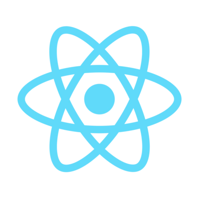

  
## Hello, I'm Seokzin
  
#### 🖥 Front-End MANIA 🖥 

#### 🔥 1 Day 1 Committer 🔥
  
#### 🎨 Interested in UI/UX 🎨 
   
#### 📚 Bookworm 📚 
  
 
 
 
  

  

 
 
  
## Stacks

 

 

 

 
 
 

## Tools

 

 

 
 
 
 
 
  

